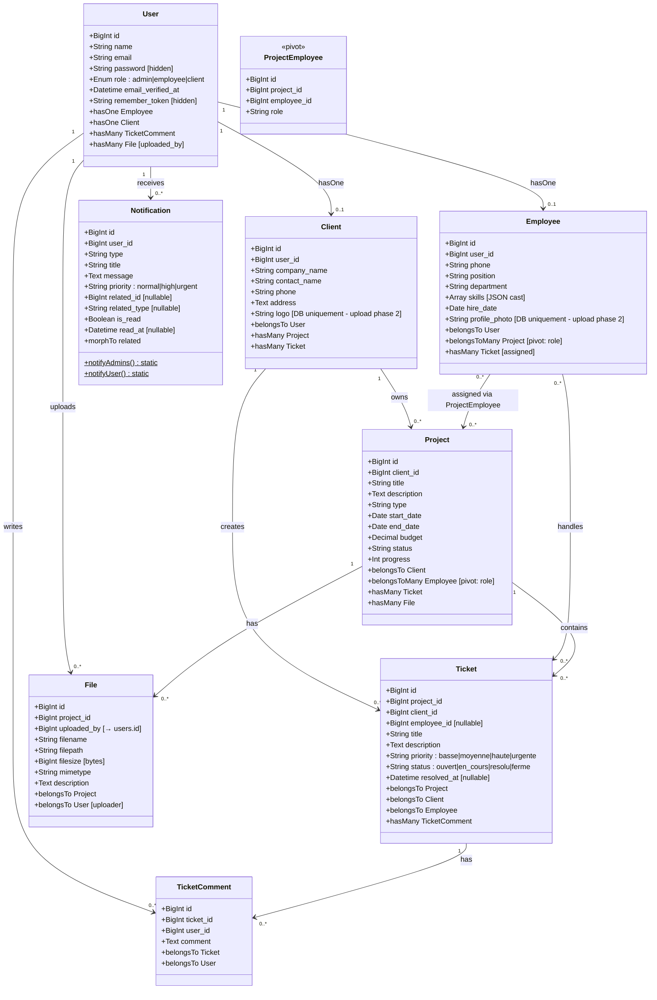
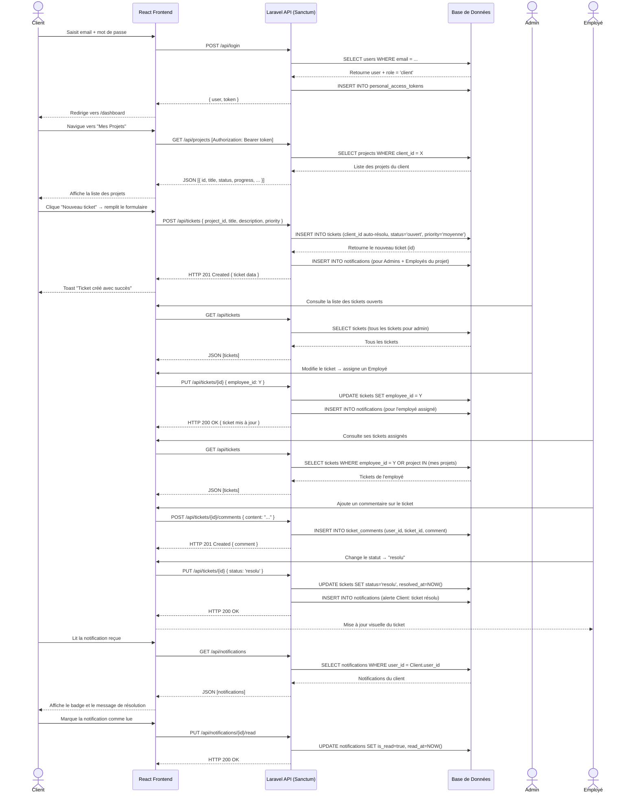

# Analyse de la Base de Données et Diagrammes UML

> **Note :** Ce document est généré à partir d'une analyse complète et rigoureuse du code source réel :
> migrations Laravel, modèles Eloquent, contrôleurs API et composants React frontend.
> Chaque attribut, chaque valeur d'enum et chaque relation sont vérifiés directement dans le code.

---

## 1. Modèle Conceptuel de Données (MCD)

### Entités Principales et leurs Attributs

> **Remarque sur la photo de profil :**
> Dans le frontend, l'avatar affiché dans le profil (`Profile.jsx`) est simplement la **première lettre du nom** de l'utilisateur (ex : « A » pour Admin). Il n'existe **pas de téléversement de photo de profil** dans l'interface actuelle. Le champ `profile_photo` existe en base de données (table `employees`), mais l'upload sera ajouté en phase 2. Ce choix de design (avatar à initiale) est standard (Gmail, GitHub utilisent la même approche).

- **User** : id, name, email, password, role (`admin` | `employee` | `client`), email_verified_at, remember_token, timestamps
- **Employee** : id, user_id (FK), phone, position, department, skills (JSON), hire_date, profile_photo *(champ DB existant, non exposé dans l'UI — photo de profil non implémentée)*, timestamps
- **Client** : id, user_id (FK), company_name, contact_name, phone, address, logo *(champ DB existant, non exposé dans l'UI)*, timestamps
- **Project** : id, client_id (FK), title, description, type, start_date, end_date, budget, status, progress, timestamps
- **Ticket** : id, project_id (FK), client_id (FK), employee_id (FK nullable), title, description, priority, status, resolved_at, timestamps
- **TicketComment** : id, ticket_id (FK), user_id (FK), comment, timestamps
- **File** : id, project_id (FK), uploaded_by (FK → users.id), filename, filepath, filesize, mimetype, description, timestamps
- **Notification** : id, user_id (FK), type, title, message, priority, related_id (nullable), related_type (nullable), is_read, read_at, timestamps

### Valeurs des Énumérations (valeurs réelles en base)

| Entité | Champ | Valeurs réelles |
|--------|-------|-----------------|
| User | role | `admin`, `employee`, `client` |
| Project | status | `planifie`, `en_cours`, `en_pause`, `termine`, `annule` *(migrées vers le français)* |
| Ticket | status | `ouvert`, `en_cours`, `resolu`, `ferme` *(migrées vers le français)* |
| Ticket | priority | `basse`, `moyenne`, `haute`, `urgente` *(migrées vers le français)* |
| Notification | priority | `normal`, `high`, `urgent` |

### Associations Conceptuelles

- Un **User** *est un* **Employee** (0,1) **OU** un **Client** (0,1) selon son `role`.
- Un **User** *rédige* des **TicketComments** (0,N).
- Un **User** *téléverse* des **Files** (0,N) via le champ `uploaded_by`.
- Un **User** *reçoit* des **Notifications** (0,N).
- Un **Client** *possède* un ou plusieurs **Projects** (1,N).
- Un **Client** *crée* des **Tickets** (0,N).
- Un **Employee** *est assigné* à des **Projects** via la table pivot `project_employee` (0,N).
- Un **Employee** *traite* des **Tickets** (0,N via `employee_id`).
- Un **Project** *contient* des **Tickets** (0,N).
- Un **Project** *contient* des **Files** (0,N).
- Un **Ticket** *possède* des **TicketComments** (0,N).

---

## 2. Modèle Logique de Données (MLD)

> Les clés primaires sont **soulignées**, les clés étrangères sont précédées de `#`.

- **users** (<u>id</u>, name, email, password, role, email_verified_at, remember_token, created_at, updated_at)
- **employees** (<u>id</u>, #user_id, phone, position, department, skills, hire_date, profile_photo, created_at, updated_at)
- **clients** (<u>id</u>, #user_id, company_name, contact_name, phone, address, logo, created_at, updated_at)
- **projects** (<u>id</u>, #client_id, title, description, type, start_date, end_date, budget, status, progress, created_at, updated_at)
- **project_employee** (<u>id</u>, #project_id, #employee_id, role, created_at, updated_at) *(Table de pivot — contrainte unique sur [project_id, employee_id])*
- **tickets** (<u>id</u>, #project_id, #client_id, #employee_id (nullable), title, description, priority, status, resolved_at, created_at, updated_at)
- **ticket_comments** (<u>id</u>, #ticket_id, #user_id, comment, created_at, updated_at)
- **files** (<u>id</u>, #project_id, #uploaded_by (→ users.id), filename, filepath, filesize, mimetype, description, created_at, updated_at)
- **notifications** (<u>id</u>, #user_id, type, title, message, priority, related_id (nullable), related_type (nullable), is_read, read_at, created_at, updated_at)
- **personal_access_tokens** (<u>id</u>, tokenable_type, tokenable_id, name, token, abilities, last_used_at, expires_at, created_at, updated_at) *(Sanctum — authentification API)*
- **password_reset_tokens** (<u>email</u>, token, created_at)
- **sessions** (<u>id</u>, #user_id (nullable), ip_address, user_agent, payload, last_activity)

### Champs implémentés en base ET dans l'UI

Tous les champs du MLD sont désormais accessibles dans l'interface :
- `budget`, `type`, `progress` → dans le formulaire de création/modification de projet (`ProjectModal`)
- `department`, `hire_date` → dans le formulaire de gestion des employés (`EmployeeModal`)
- `resolved_at` → affiché sur les tickets résolus
- `description` des fichiers → champ optionnel lors de l'upload

> [!NOTE]
> Seuls `profile_photo` (employees) et `logo` (clients) restent en base de données sans interface d'upload — choix de design, prévu en phase 2.

---

## 3. Diagramme des Cas d'Utilisation (Use Case Diagram)

```
Acteurs : Client | Employé | Administrateur

┌───────────────────────────────────────────────────────┐
│         Système Promptis Manager                      │
│                                                       │
│  [Gérer son profil]          ← Client, Employé, Admin │
│  [Changer son mot de passe]  ← Client, Employé, Admin │
│                                                       │
│  [Voir ses projets]          ← Client                 │
│  [Créer un ticket]           ← Client                 │
│  [Suivre ses tickets]        ← Client                 │
│  [Télécharger des fichiers]  ← Client                 │
│  [Recevoir des notifications]← Client, Employé, Admin │
│                                                       │
│  [Voir ses projets assignés] ← Employé                │
│  [Traiter/Résoudre tickets]  ← Employé                │
│  [Commenter un ticket]       ← Employé, Client, Admin │
│  [Téléverser des fichiers]   ← Employé, Admin         │
│                                                       │
│  [Créer/modifier un projet]  ← Admin                  │
│  [Assigner employés→projet]  ← Admin                  │
│  [Gérer les employés]        ← Admin                  │
│  [Gérer les clients]         ← Admin                  │
│  [Gérer tous les tickets]    ← Admin                  │
│  [Consulter le tableau bord] ← Admin, Employé, Client │
└───────────────────────────────────────────────────────┘
```

---

## 4. Diagramme de Classes (Class Diagram)



---

## 5. Diagramme de Séquence — Création et résolution d'un ticket



---

## 6. Architecture Technique (Résumé)

| Couche | Technologie | Détails |
|--------|-------------|---------|
| **Frontend** | React 18 + Vite | Pages : Dashboard, Projets, Tickets, Fichiers, Clients, Employés, Profil |
| **Routing** | React Router v6 | Routes protégées par rôle via `AuthContext` |
| **Styling** | Tailwind CSS + Heroicons | Composants modaux pour chaque entité |
| **Charts** | Recharts | PieChart et BarChart (commentés, prêts à activer) |
| **Backend** | Laravel 11 | API REST + Sanctum (tokens API) |
| **Auth** | Laravel Sanctum | Token Bearer dans les headers HTTP |
| **BDD** | MySQL | 12 tables dont 2 pivots (project_employee, sessions) |
| **Notifications** | Modèle custom | `Notification::notifyAdmins()` + `notifyUser()` statiques |

### Flux d'authentification réel

```
[User] → POST /api/login → [AuthController] → Crée un personal_access_token
                                             → Charge client ou employee selon role
                                             → Retourne { user: {..., client/employee: {...}}, token }
[Frontend] → Stocke token dans localStorage → Injecte dans chaque requête via axios
```

### Contrôle d'accès par rôle (Middleware + Logique)

| Route | Admin | Employé | Client |
|-------|-------|---------|--------|
| GET /employees | ✅ | ❌ | ❌ |
| GET /clients | ✅ | ❌ | ❌ |
| GET /projects | ✅ (tous) | ✅ (ses projets) | ✅ (ses projets) |
| POST /projects | ✅ | ❌ | ❌ |
| GET /tickets | ✅ (tous) | ✅ (assignés ou projet) | ✅ (ses tickets) |
| POST /tickets | ✅ | ✅ | ✅ |
| GET /notifications | ✅ | ✅ | ✅ |

---

**Conseil d'utilisation dans Gemini ou Notion :**
Copiez-collez le contenu Mermaid des sections 4 et 5 dans **https://mermaid.live** pour générer les visuels.
Pour Gemini, collez l'intégralité du document — il comprend nativement le Markdown et la syntaxe Mermaid.
